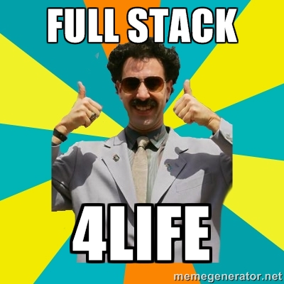

# Node HTTP M*C DEMO

### Objectives

- Create controller modules that inherit shared methods and attributes from an application controller
- Create models that write to and access data from both a MongoDB and a PostgreSQL database
- Create a webapp that uses data attributes to maintain a single page flow
- Successfully use callbacks to make sure everything happens in the right order



### Introduction

 A philosophical debate exists among the global WDI instructional staff. One faction believes that teaching frameworks like Ruby on Rails and Express does not allow students to explore programming fundamentals. The other group believes that using frameworks prepares students for working in the real world and saves enough time to allow students to tackle interesting questions within their project work. Both sides have merit. Today, we will operate somewhere in between. We will have railsy aspects pre-written for us, but we will also be operating in the wild west.

###  The difference

With rails, we get a lot of stuff for free. Our code looks neat and dry because a lot of what makes rails tick happens behind the scenes. Next week, we will get to use a Node framework that, similarly to rails, does much of the heavy lifting for us. We dont't have any of those tools for us today. We need to create our own router, manually parse our uri, manually chunk our incoming data, etc.

### Getting started

In lieu of football season starting, we are going to make a fantasy sports app. In lieu of football teams having an impossible number of players to account for, we are going to make a fantasy basketball app.

Fork and clone this repo. You will notice that there are two sub-directories within the main repository. One holds our API, while the other holds our webapp.

First, cd into your `basketball-api` and run `npm install`. All of the required packages are already listed as dependencies in your `package.json`, so we won't need to run this command again.

Next, cd into the `basketball-webapp` directory and run `bower install`. We now have downloaded all of the packages we need in this exercise.

## Modeling

By now, Antony has waxed philosophically about the difference between relational and noSQL databases. Zoidberg says:


### Why use both?

Our app will have four models: user, ownership, teams and players. We have team and player models that we want to query from quickly, but these teams need to be owned by users, which is a relational database.

### Setting up Sequelize

Sequelize is an Node.js ORM for SQL databases. Before you start hyperventilating at the possibility of having to learn another ORM, take comfort in the fact that the Sequelize's syntax is extremely similar to Mongoose. First, however, we need to do some setup in `psql`.

Open `psql` in your terminal. Next, lets recreate a new database. Run:

```SQL
CREATE DATABASEBASE basketballapp;
```

If that runs without error, create a new role. We are giving this role login privileges, so we run:

```SQL
CREATE ROLE <name> WITH LOGIN PASSWORD <your-password>;
```

Remember this info, because we will be using it in a minute.

We already have a `models` directory in our `basketball-api` directory. Cd into it, and touch a new file called `index.js`. We are going to create both connections to our databases, import all of our models and export an module containing all of our modules in this file

At the top of our `index.js`, import the Sequelize module that npm downloaded for us:

```javascript
var Sequelize = require('sequelize');
```

Next, let's create a connection to our PostgreSQL database using this syntax:

```javascript
var database = new Sequelize('basketballapp', <your-role>, <your-role-pass>, {
  host: "localhost",
  port: 5432,
  dialect: 'postgres'
});
```

Next, do the same for our mongoose module and connection:

```javascript
var mongoose = require('mongoose');
mongoose.connect('mongodb://localhost/basketballapp');
```

We now have our modular database connection that we can use to link each of our PostgreSQL models to the database.

### Our first Sequelize model

Time to create our user model.

Touch a file called `user.js` in the `models` directory. In this file, we are going to exporting a function that will create return our new model. The sequelize (lowercase) database connection that we created in our `index.js` has a method called `.import` that will call our exported function with the necessary injected dependencies (it will pass it the sequelize database connection and an object called Datatypes as arguments).

Add these lines to our `index.js`:

```javascript
var models = {};
models.User = sequelize.import('./user');
```

Now, the fun begins.

Our sequelize database connectio has a method called `.define` that let's us define a new model.

The first argument of `.define` is a string that is the name of the model, the second argument is an object literal that contains all of the datatypes that we want our model to have and the third argument is an object literal containing a wide range of options for customizing our new model. We are mostly concerned with the first and second arguments.

Let's go ahead an define our model:

```javascript
module.exports = function(sequelize, Datatypes){
  var User = sequelize.define('User', {
    id: {
      type: Datatypes.INTEGER,
      autoIncrement: true,
      primaryKey: true,
      allowNull: false
    },
    firstName: {
      type: Datatypes.STRING,
      allowNull: false
    },
    lastName: {
      type: Datatypes.STRING,
      allowNull: false
    },
    email: {
      type: Datatypes.STRING,
      allowNull: false,
      unique: true,
      validates: {
        isEmail: true
      }
    }
  }, {
    classMethods: {
      associate: function(models){
        User.hasMany(models.Ownership)
      }
    }
  });

  return User;
};
```

The first column in our user table will be our primary key. The primary key is an integer, it auto increments and it can not be false. Our second column is a firstName that is a string and has to exist. Same for our third column, lastName. Our final column makes use of one of the nifty built-in validator that allows us to check to see if the email column follows valid email format.

Sequelize has plenty more ways to configure your model's schema. I invite you to take a look at the [documentation](http://docs.sequelizejs.com/en/latest/docs/models-definition/)
when you get a chance. These columns will suffice for our purposes though.

In our third argument, we declare a class method that our uppercase `User` will have.
We will use this `.associate` method to create all of our associations in our `index.js`. That will come later, though.

Let's switch back to our `index.js`. Now that our `sequelize.import` actually points somewhere and is presumebly returning our `User` model, it's time to export that badboy to use elsewhere in our app.

First, we sync our current schema with our psl database by running:

```javascript
sequelize.sync();
```

Then we export our models:

```javascript
module.exports = models;
```

At this point, you should be able to run the `scripts/testUsers.js` script once. If not, let one of the instructors or myself know!

### Mongoosetime

We will use the same dependency injection tactic to create our `Team` model in our `index.js`. `mongoose` doesn't come with a `.import` method though, so we will have to roll our own.

Add this line after the line where we imported our `User` model:

```javascript
models.Team = require('./team')(mongoose);
```

Next, touch a file called `team.js` in your `models` directory. Just like last time, we are going to export a function in this file that returns our `Team` model.

Let's go ahead and do that:

```javascript
'use strict';

module.exports = function(mongoose){

  var Schema = mongoose.Schema;

  var playerSchema = new Schema({

    name: {
      type: String,
      required: true
    },

    team: { type: Schema.Types.ObjectId, ref: 'Team' },

    jerseyNumber: {
      type: Number,
      required: true
    },

    position: {
      type: String,
      enum: { values: 'PG SG SF PF C'.split(' '),
              message: 'enum failed at path {PATH} with value {VALUE}'
            }
    }
  });

  var teamSchema = new Schema({
    name: {
      type: String,
      required: true
    },
    city: {
      type: String,
      required: true
    },
    players: [playerSchema]
  });

// dependent destroy substitute
  // teamSchema.post('remove', function(team){
  //   Ownership.destroy({where : { teamId: team._id.toString()} }).then(function(){
  //     console.log('We are in SYNC');
  //   });
  // });

  var Team =  mongoose.model('Team', teamSchema);

  return Team;
}
```

As you can see, we are creating a team with an embedded player schema. We inject our mongoose connection into our `team.js` file via an argument on our exported function. First, we create our player schema, which has required name, position, and jerseyNumber fields. Position is an enum, meaning it can only be one of the all caps strings in our array. Next, we create our team schema, embed the player schema in it, then create and export our model.

And that's it. Our `Team` model is ready for action.

### Joining PostgreSQL and MongoDB

Now, its time to create the join between our our `User` model and our `Team` model. Fun stuff!

We are going to be creating an `Ownership` model as the join between these two. Add the line:

```javascript
models.Ownership = sequelize.import('./ownership');
```

 . . . right underneath where we import our other models in our `index.js`. We are going to follow the same pattern in creating this model as we did with our `Team` model. Touch a `ownership.js` file in our `model` directory.

 In this file, type the following code:

 ```javascript
 module.exports = function(sequelize, Datatypes){
   var Ownership = sequelize.define('Ownership', {
     id: {
       type: Datatypes.INTEGER,
       autoIncrement: true,
       primaryKey: true
     },
     teamId: {
       type: Datatypes.STRING,
       allowNull: false
     }
   }, {
     classMethods: {
       associate: function(models){
         Ownership.belongsTo(models.User, {
           onDelete: "CASCADE",
           foreignKey: {
             allowNull: false
           }
         });
       }
   }
 });

   return Ownership;
 };
```

As we did before, we are exporting a function that expects our `sequelize.import` method to inject the `sequelize` object and the `Datatypes` object.

We give it its primary key ID, we write in our relationship with team as an `associate` class method like we did last time (with the Sequelize equvilent of `dependent: :destroy`), and we create a column called 'teamID' that will take a stringified version of our `Team`'s objectID's.

Now that our two PostgreSQL models are defined, we need to actually associate them. Sequelize provides us with a nifty script that we can include in our `index.js` to do exactly that:

```javascript
Object.keys(models).forEach(function(modelName) {
  if ("associate" in models[modelName]) {
    models[modelName].associate(models);
  }
});
```

It will iterate through our models, and if that model has an `associate` key a.k.a method name, it will run the method.

We are almost set here. There is one more loose end that we still have to tie up.
As some on you may have noticed, we have a destroy hook on our that will remove all of the ownerships that a user owns when the user is destroyed, we do not have the same for our teams. Since the two models exist in different ORM's, we don't have any built-in functionality to facilitate this. Instead, we have to roll our own once again.

Modify your chunk of model importation code to look like this:

```javascript
models.User = sequelize.import('./user');
models.Ownership = sequelize.import('./ownership');
models.Team = require('./team')(mongoose, models);
```
We are first importing our `Ownership` model, then injecting it into our `Team definition`.

Next, add models as an argument that the function that `ownership.js` exports takes. Finally, uncomment this code in our function:

```javascript
teamSchema.post('remove', function(team){
  models.Ownership.destroy({where : { teamId: team._id.toString()} }).then(function(){
    console.log('We are in SYNC');
  });
});
```

Now, when a team is removed, this hook will fire, and we will delete all of the associated ownerships with it.

We should be all set now. Try running `scripts/seed.js`. If it doesn't work, we done goofed!

## Controllertime

We now have our first model, but we are still a bit off from rendering any resources.

There are many different approaches we could take at this point toour advance our goal, but let's go ahead and stick with what we are familiar with: an M*V model.

So next, we need our controllers.

We are going to be creating controllers for each of our resources, but just like in rails, most of what each of these individual controllers will have to do will be the same.

Therefore, we have an ApplicationController prototype that will serve as the base for each of our individual controller prototypes.

Let's go ahead and take a gander at this prototype in `controllers/applicationController.js`.

If the ApplicationController constructor is passed arguments, it will have a response object and a params object stored in its scope.

The first prototype method, `render`, mirrors that of rails. We pass it a resource, and an options object if necessary, and it renders the resource as JSON.

The second prototype method, `parseURI`, is a the `url.parse` method that we've been using on steroids. It will take our uri and parse it into a params object of the good stuff we need to manipulate the right resources in our controller actions.

The third prototype method, `gatherRequest`, will chunk together all of our incoming data before running a controller action. We pass in our request object and the controller action that we want to perform as a callback. The callback controller action will fire once all of the request data has been chunked.

The fourth prototype method, `grantHTTPAccess`, adds CORS headers to our response object. Our server is currently a wide open gate, but that's ok.

The fifth prototype method, `head`, responds to a http request with a status 204 and no content in the body.

The sixth prototype method, `handleOptions`, will be used to respond to pre-flight HTTP requests for more elaborate http requests.

The last two prototype methods are self explanatory.

If we do inheritance right, all our controller prototypes will have access to all of these prototype functions.

### Our first controller

Touch a file called `usersController.js` in your `controllers` directory. We will be controlling, you guessed it, our users.

We start our file off with this code:

```javascript
'use strict';

// we import our mongoose model here
var models = require('../models/index');

//we import our application controller here
var ApplicationController = require('./applicationController');
```

The first line applies `Strict mode`. `Strict mode` applies semantic and optimization changes to your javascript code. What exactly it does or how it does it, doesn't matter: just try to include it at the top of all of your javascript files.

We also import our models and our Application Controller.

Next, we create our `UsersController` constructor and set it up to inherit from an `ApplicationController` instance.

```javascript
var UsersController = function(response, uri){
  ApplicationController.apply(this, arguments);
};

UsersController.prototype = new ApplicationController();
```

In our `UsersController`, we run our `ApplicationController` constructor IN THE CONTEXT OF our `UsersController`. Basically, this allows us to reuse our ApplicationController constructor code in all of our other controllers.

After our constructor is declared, we set its prototype equal to a new instance of `ApplicationController`.

As of now, our `UserController` is a clone of our `ApplicationController`. Let's go ahead and add our controller actions as prototype methods and make this bad boy unique!

Our first controller action will be an index:

```javascript
UsersController.prototype.index = function(){
  var self = this;
  models.User.findAll({}).then(function(users){
    self.render(users);
  }, function(err){
    self.renderError(err);
  });
}
```

First we store a reference to this in the context of the prototype method, since the context of this changes in our callback, then we make our query and render the resources when our query is finished.

The syntax of a `Sequelize` query varies slightly from that of `Mongoose` in the respect that it does not accept a callback as an argument. Instead, much like with AJAX, we need to handle the promise ourselves.

We call `.then` and pass it two callbacks. The first will be run on success. The second will be run on failure. It is very important that we handle these errors, or else our server will shut down when something goes amiss.

Next, let's write prototype methods to perform a show action. We know that we are going to have multiple actions that will require us to set a single user, so let's create a prototype method to do this.

```javascript
UsersController.prototype.setUser = function(action){
  models.User.findById(this.params['userId']).then(function(user){
    action(user);
  }, function(err){
    self.renderError(err);
  });
}
```

We are expecting our `parseURI` function to create a `params` object within the scope of our controller. This method will provide us with a userID that we can use in our queries. We pass this method a callback that will be run on the resources only when the resource has been retrieved. We handle our query with a `.then`, which takes our success callback and our fail callback.

Now, we can declare our show action prototype method:

```javascript
UsersController.prototype.show = function(){
  var self = this;
  this.setUser(function(user){
    self.render(user);
  });
}
```

We set our user, then render it. We know we will pass the user into the callback in the `setUser` function, so we give the callback that we pass into `setUser` a user argument.

The same principles apply to our `destroy` action. This time however, we perform another `Sequelize` query in our function, so we need to handle that potential error as well:

```javascript
UsersController.prototype.destroy = function(){
  var self = this;
  this.setUser(function(user){
    user.destroy().then(function(){
      self.head();
    }, function(err){
      self.renderError(err);
    });
  })
}
```

Our create action is a little more complicated:

```javascript
UsersController.prototype.create = function(request){
  var self = this;
  self.gatherRequest(request, function(user){
    models.User.create(user).then(function(user){
      self.render(user);
    }, function(err){
      self.renderError(err);
    });
  });
}
```

We use our `.gatherRequest` ApplicationController method to chunk together the request data. This method takes two arguments, `response` and callback that runs after all of the data has been chunked that takes the chunked data as an argument. Try saying that ten times fast.

Finally, we export our `UserController` constructor and we should be all set!

## Routing in a wasteland

Routing is a pain in the ass in Node HTTP land. Prepare for tears.

Let's pop over to our `app/server.js` and see what we have. Right now, we have a server that will start, but won't respond to requests. We have our barebones Node modules imported, but nothing else. Let's import our `UserController` and `ApplicationController` constructor modules right underneath the comment:

```javascript
// we import our controllers here
var ApplicationController = require('../controllers/applicationController');
var UsersController = require('../controllers/usersController');
```

Inside of the anonymous function we pass our `http.createServer` method, after we parse the url, add the beginnings of our router:

```javascript
switch (uri.pathname) {
  case "/users":
    var usersController = new UsersController(response, uri);
    switch (request.method) {
      case "GET":
        usersController.index();
        break;
      case "POST":
        usersController.create(request);
        break;
      default:
        usersController.render404();
        break;
    }
    break;
  case uri.pathname.match(/(\/users\/)\d+/) ? uri.pathname.match(/(\/users\/)\d+/)[0] : null:
    var usersController = new UsersController(response, uri);
    switch (request.method) {
      case "GET":
        usersController.show();
        break;
      case "DELETE":
        usersController.destroy();
        break;
      case "OPTIONS":
        usersController.handleOptions();
        break;
      default:
        usersController.render404();
        break;
    }
    break;
  default:
      var applicationController = new ApplicationController(response, uri);
      applicationController.render404();
      break;
  }
```

Our router is going to be a giant switchboard that first switches on pathname, then switches on http method within each pathname case. Once we know we are dealing with a given resource. We create new instance of that resource's controller. We run the appropriate action through the appropriate router depending on the http method.

If the pathname matches none of our defined routes. We create a new instance of our `ApplicationController` prototype and use it to render a 404.

About that ugly regex . . . . We are checking each case against the pathname, so it is not enough to check whether or not the pathname is a match with the regex. We first check to see whether the pathname is a match using a ternary operator. If it is a match, we return the first element of the array of matches that `.match produces`, which will be the longest applicable match. If not, we return null, which obviously won't match the string. We will use this pattern whenever we want to route pathnames with variable parameters.

Now we should be able to serve users to our browser! Fire up the server, open up your browser, then navigate to `http:localhost:8888/users`.

You should see the json of Fred Durst.

## Consuming our API

JSON as fine and good and all, but we probably want our visitors to be able to navigate a webpage that renders our users as html.

We won't spend too much time in cliend-side-land, because this will come mostly as review.

Go to your `basketball-webapp` directory, then check out `scripts/app.js`. Unless I goofed, this file will look like :

```javascript
'use strict';

var App = (function(){

  var apiURL = "http://localhost:8888";

  var init = function(){
  // event handlers go here  
  };

  return {
    init: init
  };

})();

$(document).ready(function(){
  App.init();
});
```

We are creating a new module using the revealing module pattern, exposing an `.init` method, then invoking our `.init` method in our document ready. All of our event handlers will go in the `init` method, and all of our render functions will stay hidden in our `App` module.

Go ahead and create a show users button and an empty content div in your `index.html`.

```javascript
<button id="users-index">Show All Users</button>

<div id="content"></div>
```

Next, let's create a handlebars template that will smash our user data into to product our list of users. We will also include a form that we can sue to create a new user:
```html
<script id="users-template" type="text/x-handlebars-template">
  <div id='user-list'>
    {{#each users}}
      <div data-id={{id}} class="user">
        <h2>{{firstName}} {{lastName}}</h2>
        <button class="user-show">See User</button>
      </div>
    {{/each}}
  </div>
  <form>
    <h4>Add User</h4>
    <label> First Name
      <input id="first-name" type="text"/>
    </label>
    <label> Last Name
      <input id="last-name" type="text"/>
    </label>
    <label> Email
      <input id="email" type="text"/>
    </label>
    <button id="new-user">Add User</button>
  </form>
</script>
```

Notice how we wrapped each user in a div with class `user` and gave it a data-id equal to the user ID. This will be very useful when we try to manipulate individual users on the front end.

Next, let's go ahead and write out javascript to render a list of users. We need an event handler on our button inside of our init function:

```javascript
$('#users-index').on('click', function(){
  $.ajax({
    url: apiURL + '/users',
    method: "GET"
  }).then(function(response){
    _renderUsers(JSON.parse(response));
  });
});
```

And a hidden function that renders our data with our template:

```javascript
var _renderUsers = function(users){
  var userTemplater = Handlebars.compile($('#users-template').html());
  var html = userTemplater({users: users});
  $('#content').html(html);
}
```

We should be able to render users on click now. Fire up both servers and see for yourself if it works.

We can now put our user create form to use.

In our html, let's create a template from which we will generate our new user html:
```html
<script id="new-user-template" type="x-handlebars-template">
  <div data-id={{user.id}} class="user">
    <h2>{{user.firstName}} {{user.lastName}}</h2>
    <button class="user-show">See User</button>
  </div>
</script>
```

This html is directly ripped out of our user list template.

We need an event handler that listens for an event on our new user button inside of our init function:

```javascript
$('#content').on('click', '#new-user', function(e){
  e.preventDefault();
  var player = {
    firstName: $('#first-name').val(),
    lastName: $('#last-name').val(),
    email: $('#email').val(),
  };

  $.ajax({
    url: apiURL + '/users',
    method: "POST",
    data: JSON.stringify(player)
  }).then(function(response){
    _renderNewUser(JSON.parse(response));
  })
});
```

And a hidden function that renders our data with our template:

```javascript
var _renderNewUser = function(user){
  var userTemplater = Handlebars.compile($('#new-user-template').html());
  var html = userTemplater({user: user});
  $('#user-list').append(html);
}

```
We create our string of html, then append it to our existing list of users.

Try creating a user. Does it work? Awesome.

To show individual users and delete them, we will need to make use of the data attribute we put on our divs with the `user` class.

First, let's create a new template for our user show page. Nothing fancy here:

```html
<script id="user-show-template" type="x-handlebars-template">
  <div data-id={{user.id}} id="user-profile">
    <h2>{{user.firstName}} {{user.lastName}}</h2>
    <p>{{user.email}}</p>
    <button class="delete-user">Delete User</button>
    <div id="teams"></div>
  </div>
</script>
```

This time, we stick the data-id inside a div with the id `user-profile`.

Now, we go to our javascript and first add our event handler:

```javascript
$('#content').on('click', '.user-show', function(){
  $.ajax({
    url: apiURL + '/users/' + $(this).closest('.user').data('id'),
    method: "GET"
  }).then(function(response){
    _renderUser(JSON.parse(response));
  });
});
```

Notice, how we are using `$(this)` here. `$(this)` is the button we clicked. `.closest` allows us to travel up the DOM tree and find the first element that suits our criteria. We search for a `.user` div, then find out user's ID exactly where we put it.

Now, we just need our templating function:

```javascript
var userTemplater = Handlebars.compile($('#user-show-template').html());
var html = userTemplater({user: user});
$('#content').html(html);
}
```

We should be able to render individual users now!

Finally, we need to create our destroy user functionality. All we need to do in this case is create our event handler:

```javascript
$('#content').on('click', '.delete-user', function(){
  var $userProfile = $('#user-profile');
  $.ajax({
    url: apiURL + '/users/' + $userProfile.data('id'),
    method: "DELETE"
  }).then(function(response){
    $userProfile.remove();
  });
});
```

We find the user profile, and store it in a variable called `$userProfile`. We use the $ because it reminds us that we have a jQuery object stored inside it.

We pull the id of the user out of the profile, then make the appropriate AJAX request. When we receive a successful response, we remove the profile from our DOM.

And just like that, we have gone full stack with our users resource.

## YOUR TURN - IT'S LAB Time

Go full-stack with our teams resource. A checklist of how to do this:

- Create a `TeamsController` prototype that inherits from an instance of `ApplicationController`
- Create index, setTeam, show, create, and delete prototype methods on the controllers prototype
- Add routes to our router switchboard that invoke our controller actions
- Create a button and a bunch of templates for rendering teams in our `index.html`
- Create rendering functions and event handlers for teams

HINTS:

- `Team` is a MONGOOSE model. It's queries take a callback that will fire when the query finishes. You do not need `.then`.
- Do not forget to end each case on your switchboard with `break;`
- DOn't overthink it! This exercise was designed to be a railsy as possible

# IF YOURE READING THIS WE MOVED TOO QUICKLY

